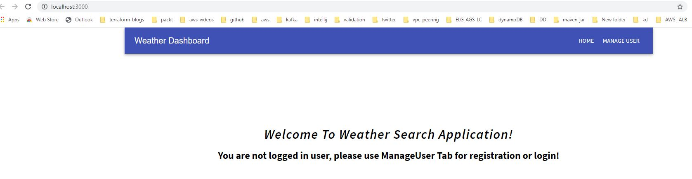
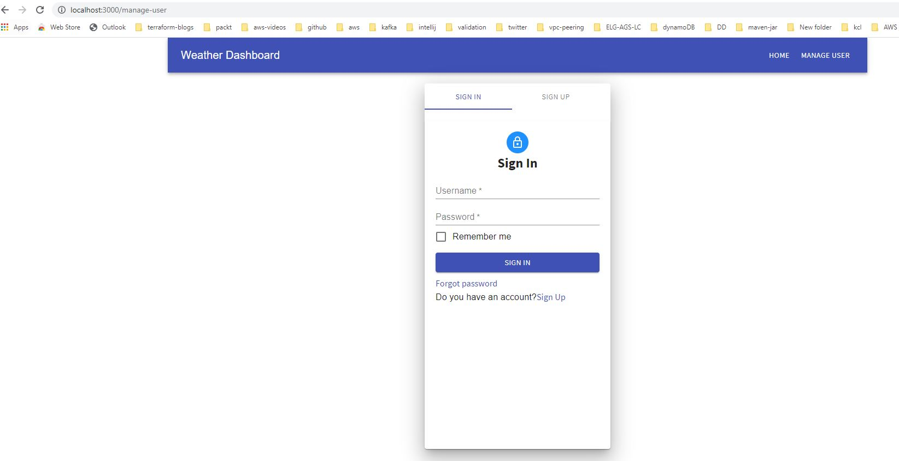
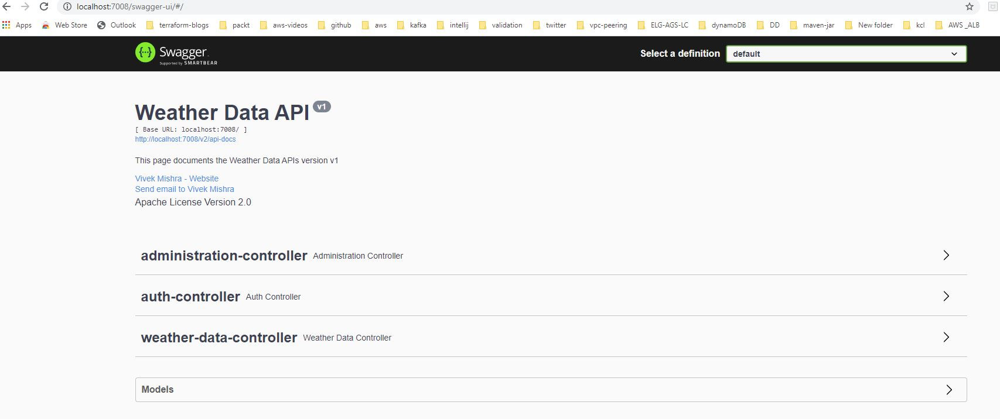

## Weather Application to search the weather data and history for a city

## Table of contents
* [General info](#general-info)
* [Technologies](#technologies)
* [Requirements not completed](#requirement-which-are-not-completed)

## General info
This project has two modules, backend [weather-api] and frontend [weather-ui].
> * Weather API Swagger Documentation link: http://localhost:7008/swagger-ui/#/
> * Frontend Application can be accessed via:  http://localhost:3000/
> * Backend H2 database can be accessed via: http://localhost:7008/h2-console/login.jsp [username: test, password:test]
> * Use `local` spring boot profile to run the application
> * Application log file will be generated in the `log` folder at root directory

## Technologies
Project is being developed using:
* Java8 & Spring Boot backend API
* H2 as backend database
* Swagger for API documentation
* ReactJS for frontend  

## Requirement which are not completed:
* Unit testing

## Testing via ReactJS 
> Start react application using `npm start` command from `weather-ui` module
> The npm start command will take around 3-5 minutes to start
> Home Page without login: 
## Login Page

## SignUp or SignIn Page:

## Swagger API Document Link: `http://localhost:7008/swagger-ui/#/`

## Local testing via PostMan
> * Register a new user: `http://localhost:7008/api/auth/signup`
>   Post API
> `{
    "username": "aws@gmail.com",
    "password": "vivek@2244",
    "dob": "1987-03-14"
    }`
> * Generate jwt token using below api using any API client application [Postman, ARC]
> `POST API: http://localhost:7008/api/auth/login`
> `JSON Body: { "username": "ll@gmail.com", "password": "vivek@2244"}`
> * Use the generated token to make an API call by passing below header:
> `Authorization: Bearer <TOKEN VALUE>` 

## Note
> Management tab is being used for `Administrator`, for this application all the user are acting as admin.